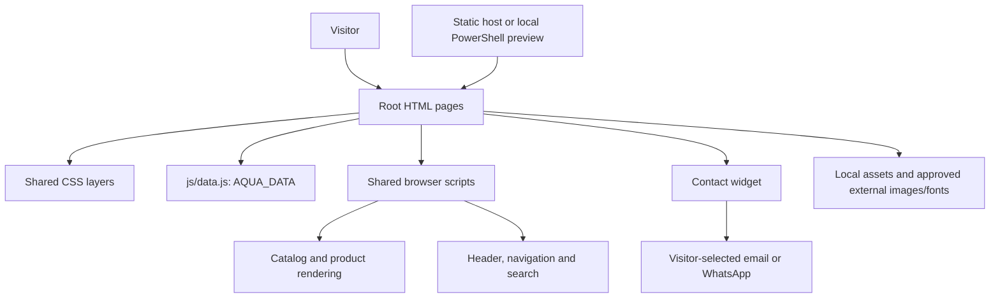

# Architecture

## Overview

Aqua Care is a static, browser-rendered website built with HTML, CSS, and JavaScript. There is no application server, database, build step, or bundler in the current runtime. The hosting provider serves files; the browser renders pages and runs interactions.

## Main parts

- **Pages:** `index.html` is the home page; `chemicals.html` presents the catalog; `applications.html` presents treatment applications. `privacy.html` is a standalone notice, and `water-hero.html` is a standalone visual page.
- **Data:** `js/data.js` defines company metadata and chemical entries, then exposes them as `window.AQUA_DATA`. This data is public because it is delivered to every browser.
- **Shared UI:** `js/header.js` builds navigation/search UI; `js/app.js` handles shared rendering, modals, and interactions. `js/fuse-loader.js` imports Fuse.js and then imports the header module.
- **Page and feature behavior:** `js/catalog.js` filters catalog data; `js/contact-widget.js` builds the contact form and opens an email or WhatsApp handoff; `js/water-ripple.js` and `js/hero-ripple.js` provide visual effects. `js/calculator.js` and `js/charts.js` contain feature helpers used where included.
- **Styles:** `css/style.css` provides shared foundations and theme, `css/components.css` contains component rules, and `css/responsive.css` applies responsive overrides. HTML pages load these styles in that order.
- **Assets:** `assets/` contains logos and images. The homepage also requests some images from Pexels; the shared stylesheet requests fonts from Google Fonts.
- **Serving and deployment:** `server.ps1` is a local development preview server. Production static hosting, HTTPS, redirects, and response headers are configured by the deployment platform.

## Runtime flow

1. The host serves a requested root-level HTML page and referenced assets.
2. Shared styles load in foundation, component, then responsive order.
3. Where included, `js/data.js` creates `AQUA_DATA` for later scripts.
4. `js/fuse-loader.js` loads Fuse.js from the installed package and dynamically imports `js/header.js`; the header mounts into `[data-site-header]`.
5. Shared and page-specific scripts initialize browser event handlers, generally after the document is ready.
6. The contact widget validates input locally. It does not send an HTTP request to this website; if the visitor chooses, it prepares a message for WhatsApp or the default email application.

Script tags live in each HTML file. Preserve data-before-consumer ordering when changing them. Some standalone pages do not include the shared data or navigation scripts.

## Data and trust boundaries

- `AQUA_DATA`, HTML, CSS, and browser JavaScript are public, editable by visitors in their own browser, and must never contain secrets or privileged credentials.
- The current site does not persist contact form submissions or include a backend API/database.
- Email, WhatsApp, Pexels, Google Fonts, and the production host are separate services with their own processing and availability. Their requests can expose technical connection information to those providers.
- The deployed response policy is described in `_headers` and `SECURITY.md`. Hosting platforms differ; verify that the production host actually applies the configured headers.

## Change and extension rules

- Keep static pages at the repository root because existing page and asset paths depend on that layout.
- Keep product and company content in `js/data.js`; update its consumers if the public data shape changes.
- Keep shared presentation in `css/`, browser logic in `js/`, and static media in `assets/`.
- Add no database or server-side collection until an approved requirement needs persistence. See `Database.md` and `phases.md` before introducing one.
- Keep failures local to the feature, present useful visitor-facing feedback, and avoid logging personal data. See `ERROR_HANDLING.md`.
- Run `npm run check` after JavaScript changes and manually verify affected pages and interactions in the browser.

## Related docs

- `README.md`: file map, page load order, and local commands.
- `Database.md`: current data source and conditional future database design.
- `SECURITY.md`: security posture and deployment requirements.
- `ERROR_HANDLING.md`: failure handling conventions.
- `phases.md`: proposed delivery roadmap.